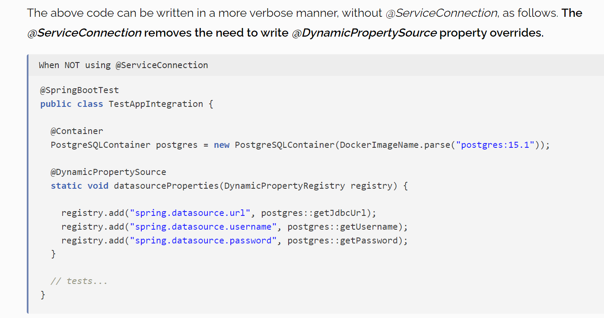

Key Annotation that is created by spring boot to support testContainers is @ServiceConnection

https://howtodoinjava.com/spring-boot/spring-boot-service-connection-example/

embedded instance of Kafka or a local broker.
in-memory Kafka instance to run our tests against. This is also known as Embedded Kafka.
